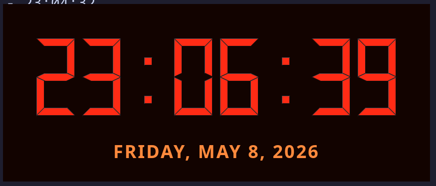
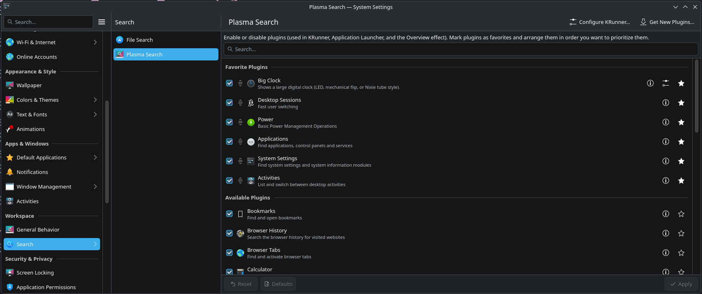
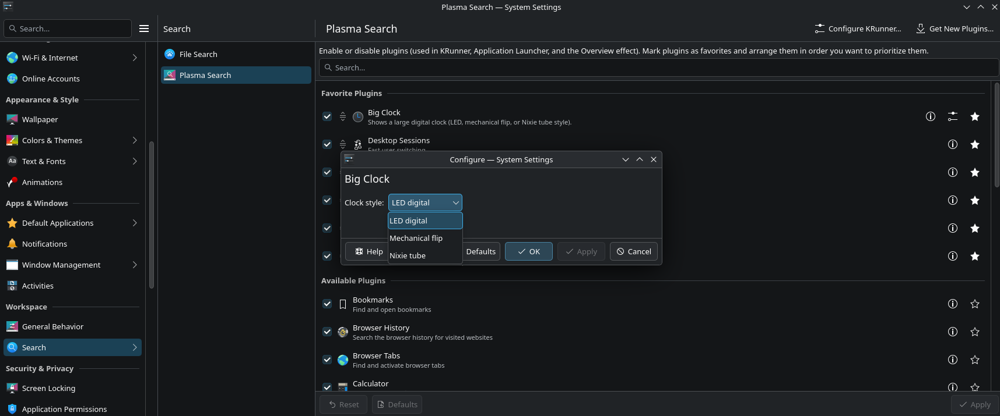
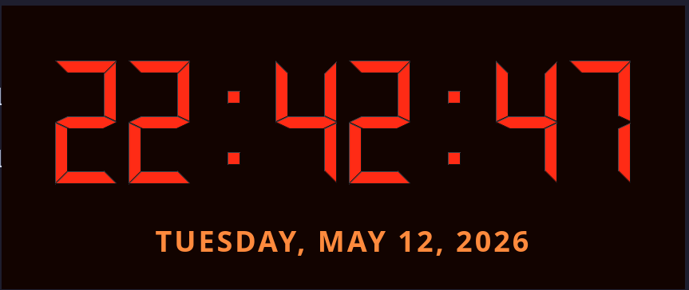
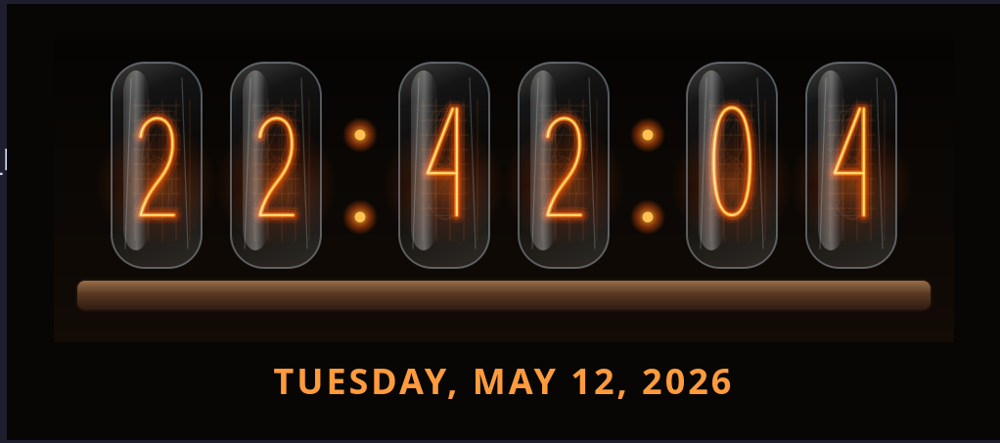

# KRunner Bigclock

KRunner Bigclock is a KDE Frameworks 6 / Qt 6 KRunner plugin that launches a small helper executable to display a large digital clock in the center of the screen.

KRunner Bigclock is licensed under the MIT license.

Invoke it from KRunner with one of:

- `bigclock`
- `big clock`
- `clock`
- `time`

The clock closes automatically after 30 seconds, or immediately when you press Escape/Enter or click it.



## Choosing the clock style

Big Clock can render the time in three styles:

- **LED digital** – a 1980s-style red seven-segment display (the default)
- **Nixie tube** – warm amber glowing tube digits
- **Mechanical flip** – a vintage rolling-number mechanical clock

Open **System Settings → Search → Plasma Search**, then find **Big Clock** in
the plugin list.



Click the configure button next to **Big Clock**, then choose the clock style
from the **Clock style** dropdown.



The setting is also available directly from the KRunner overlay's
configuration. Your choice takes effect the next time you open the clock.

### Clock styles

Choose **LED digital** for the default red seven-segment display.



Choose **Nixie tube** for glowing amber tube digits.



Choose **Mechanical flip** for a vintage rolling-number mechanical clock.


## Build

Install build dependencies first.

### Arch Linux / CachyOS

```sh
sudo pacman -S --needed base-devel cmake extra-cmake-modules qt6-base ki18n krunner kconfig kcmutils
```

### Fedora

```sh
sudo dnf install cmake extra-cmake-modules gcc-c++ make qt6-qtbase-devel kf6-ki18n-devel kf6-krunner-devel kf6-kconfig-devel kf6-kcmutils-devel
```

### Ubuntu / Debian

KF6 development packages are available in recent Ubuntu/Debian releases. Package names may vary slightly by release, but start with:

```sh
sudo apt update
sudo apt install build-essential cmake extra-cmake-modules qt6-base-dev libkf6i18n-dev libkf6runner-dev libkf6config-dev libkf6kcmutils-dev
```

If `libkf6runner-dev` is unavailable, your distribution release may not ship KF6 KRunner development headers yet; use a newer release or install the KDE Frameworks 6 development packages from your distribution's KDE/Plasma repository.

Then build:

```sh
cmake -S . -B build -DCMAKE_BUILD_TYPE=Release
cmake --build build
```

## Install the KRunner plugin

### User-local install

This installs the plugin under `~/.local` without requiring root:

```sh
cmake --install build --prefix ~/.local
```

Restart KRunner so it discovers the new plugin:

```sh
krunner --replace --daemon &
```

Open KRunner and type `bigclock`. If needed, confirm the plugin is enabled in **System Settings → Search → KRunner → Plugins**.

The install step installs the KRunner plugin, the `krunner-bigclock-window` helper executable, and AppStream metadata. The helper must be discoverable in KRunner's environment. System-wide installs to `/usr` work automatically; for user-local installs, make sure `~/.local/bin` is in your login/session `PATH`.

You can also verify that KRunner sees the plugin with:

```sh
krunner --list | grep -i "big clock"
```

If the plugin is listed but no result appears for `bigclock`, check the per-user KRunner config. An explicit disabled entry overrides the plugin's enabled-by-default metadata:

```sh
kreadconfig6 --file krunnerrc --group Plugins --key krunner_bigclockEnabled
kwriteconfig6 --file krunnerrc --group Plugins --key krunner_bigclockEnabled true
krunner --replace --daemon &
```

If the `Show Big Clock` result appears but activating it does nothing, verify the helper runs directly and inspect recent user-session logs:

```sh
krunner-bigclock-window
journalctl --user -b --since "5 minutes ago" | grep -iE "bigclock|krunner"
```

If the helper works directly but activation from KRunner still does nothing, Plasma may have stale runner/plugin state loaded. Restart Plasma Shell and KRunner:

```sh
systemctl --user restart plasma-plasmashell.service
krunner --daemon >/tmp/krunner.log 2>&1 &
```

Avoid using plain `krunner &` for restart instructions; on some Plasma systems it may print a portal app-ID warning such as `App info not found for 'org.kde.krunner'`. Starting with `krunner --replace --daemon &` avoids that foreground-launch warning, backgrounds the process, and ensures the already-running KRunner process reloads newly installed plugins.

### System-wide install

To install for all users, install into the KDE/Qt prefix, commonly `/usr` on Linux distributions:

```sh
sudo cmake --install build --prefix /usr
krunner --replace --daemon &
```

### Uninstall

Remove the installed module and restart KRunner. For a user-local install:

```sh
rm -f ~/.local/lib/qt6/plugins/kf6/krunner/krunner_bigclock.so
rm -f ~/.local/lib/qt6/plugins/kf6/krunner/kcms/kcm_krunner_bigclock.so
krunner --replace --daemon &
```

Depending on the distribution, the plugin directory may be `~/.local/lib/plugins/kf6/krunner`, `~/.local/lib64/qt6/plugins/kf6/krunner`, or another Qt plugin path; check the `cmake --install` output if the path differs.

## Build Distribution Packages

Packaging metadata is included for Arch Linux, Debian/Ubuntu, and
Fedora/RHEL-style RPM builds. These package recipes expect KDE Frameworks 6 and
Qt 6 development packages to be available from the target distribution.

### Arch Linux Package

From the repository root, create a source archive, copy the `PKGBUILD` into a
clean packaging directory, then build with `makepkg`:

```sh
mkdir -p build-package/arch
tar --exclude=.git --exclude=build --exclude=build-clang --exclude=build-package \
    --transform='s#^\./#krunner-bigclock-0.1.0/#' \
    -czf build-package/arch/krunner-bigclock-0.1.0.tar.gz .
cp packaging/arch/PKGBUILD build-package/arch/
cd build-package/arch
makepkg -sr
```

For release builds from a published tag, update `source` and `sha256sums` in
`packaging/arch/PKGBUILD` to point at the tagged GitHub source archive.

### Debian/Ubuntu Package

Debian/Ubuntu packaging metadata is included but has not yet been validated in
a Debian or Ubuntu build environment.

Build the Debian package directly from the source tree:

```sh
dpkg-buildpackage -us -uc -b
```

The resulting `.deb` files are written to the parent directory. On Ubuntu or
Debian releases that do not yet ship KF6 KRunner development packages,
`libkf6runner-dev` may be unavailable; use a release with KDE Frameworks 6
development packages.

Run Debian package checks on a Debian or Ubuntu system:

```sh
lintian ../krunner-bigclock_*.changes
```

On Arch Linux, avoid installing the AUR `lintian` package just to validate this
package. Its dependency chain includes Debian `apt`, which may conflict with
Arch systems using `zlib-ng-compat`. Prefer running `dpkg-buildpackage` and
`lintian` in a Debian/Ubuntu VM, container, or chroot.

### Fedora/RHEL RPM Package

Fedora/RHEL RPM packaging metadata is included but has not yet been validated
in a Fedora or RHEL build environment.

Create a source archive, copy the RPM spec into `rpmbuild`, and build:

```sh
mkdir -p ~/rpmbuild/SOURCES ~/rpmbuild/SPECS
git archive --format=tar.gz --prefix=krunner-bigclock-0.1.0/ \
    -o ~/rpmbuild/SOURCES/krunner-bigclock-0.1.0.tar.gz HEAD
cp packaging/rpm/krunner-bigclock.spec ~/rpmbuild/SPECS/
rpmbuild -ba ~/rpmbuild/SPECS/krunner-bigclock.spec
```

Binary RPMs are written under `~/rpmbuild/RPMS/`.

## Linting tools

Install the project linting tools with one of:

```sh
# Arch Linux / CachyOS
sudo pacman -S --needed clang clazy cppcheck

# Fedora
sudo dnf install clang-tools-extra clazy cppcheck

# Ubuntu / Debian
sudo apt install clang-format clang-tidy clazy cppcheck
```

Run the checks listed in `AGENTS.md` after code changes.
